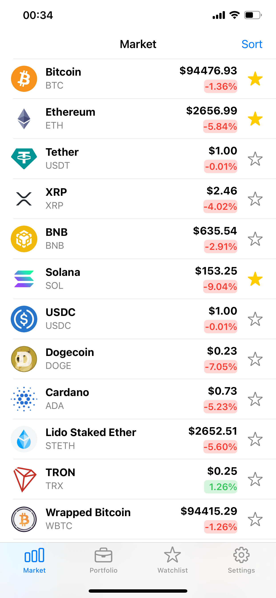
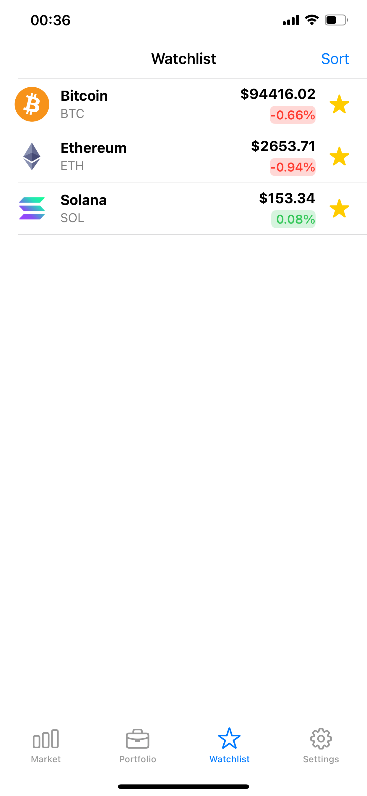
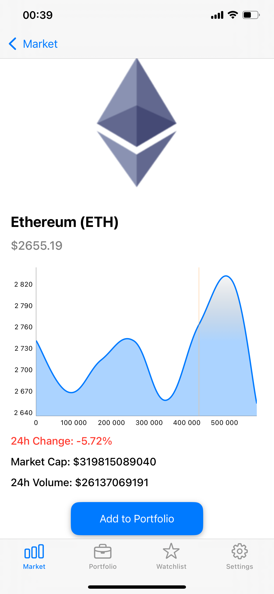
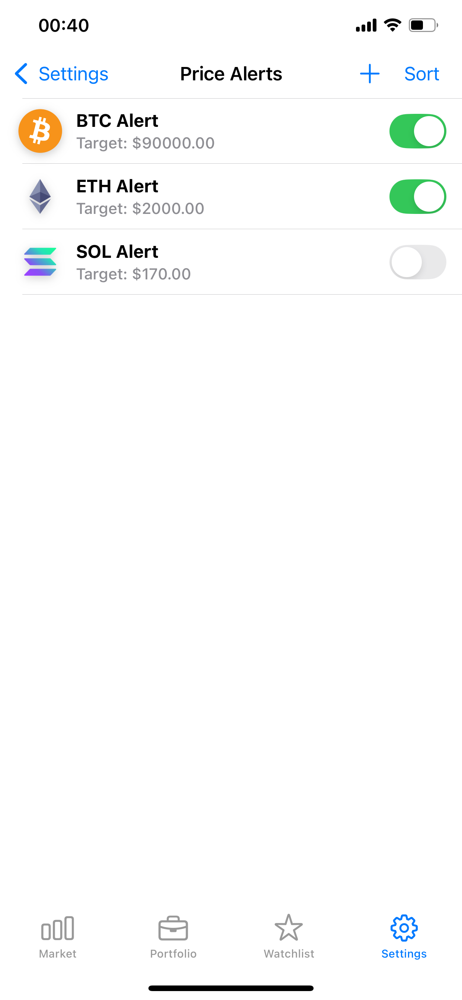
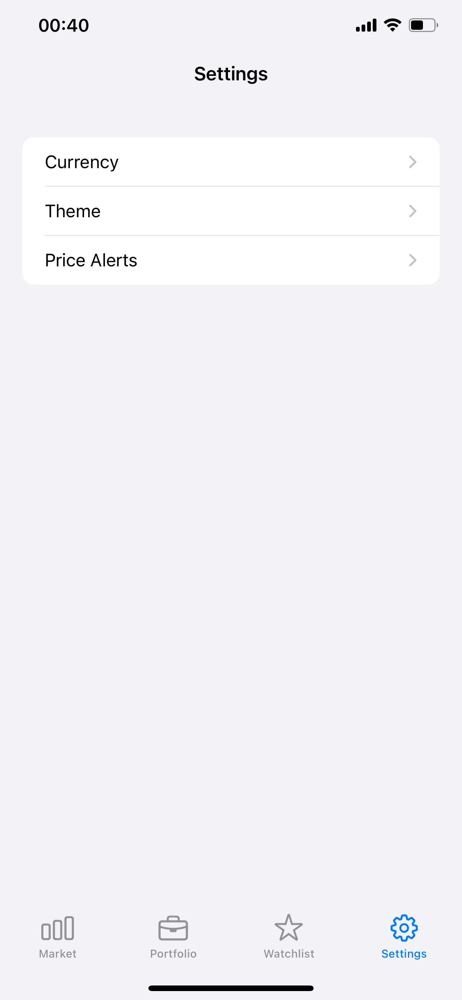

# 📱 SatoshiScan  

SatoshiScan is a **pet project iOS application** for tracking cryptocurrency prices in real-time. It includes a market overview, a customizable watchlist, a personal portfolio with amount tracking, and price alerts for significant price changes.

---

## 🚀 Features  

🔹 **Market Overview** – Real-time cryptocurrency prices updated via WebSocket  
⭐ **Watchlist** – Save favorite cryptocurrencies and track their performance  
📊 **Portfolio** – Add cryptocurrencies with a specified amount and track their value  
🔔 **Price Alerts** – Set notifications for price movements  
🎨 **Settings** – Choose a preferred currency (`USD`, `EUR`, `KZT`, `RUB`), switch between light and dark themes  

---

## 📷 Screenshots

| Market | Watchlist | Portfolio |
|--------|----------|-----------|
|  |  |  |

| Crypto Detail | Price Alerts | Settings |
|--------------|-------------|----------|
|  |  |  |


---

## 🛠 Technologies Used  

- **Swift** – Core programming language  
- **UIKit** – UI framework for iOS development  
- **Core Data** – Local database for storing portfolio and watchlist  
- **WebSockets** – Real-time price updates  
- **CoinGecko API** – Fetching cryptocurrency market data  

---

## 📥 Installation  

To run the project locally, follow these steps:

1. **Clone the repository**
   ```bash
   git clone https://github.com/amanbayserkeev0377/SatoshiScan.git
   cd SatoshiScan
2. Open the project in Xcode.
-  Open SatoshiScan.xcodeproj in Xcode.
3. Install dependencies if needed. Build and run the project on an iOS simulator or device

## 📜 License
This project is licensed under the **MIT License** – see the [LICENSE](LICENSE) file for details.

## 📬 Connect with Me

- **LinkedIn**: [Aman Bayserkeev](https://www.linkedin.com/in/amanbayserkeev/)
- **GitHub**: [@amanbayserkeev0377](https://github.com/amanbayserkeev0377)